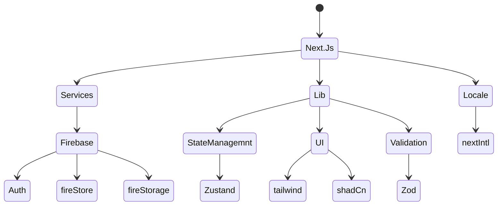

```
Here i will show each step in this project it will be as a learning tutorial
```

---

# Tech stack



<br/>

---

# File strucure

### ((Src)) dir that will make the project more orgnaized and scalabe

- Lib dir including the things is related to libraries

- Components dir it will include some dirs one of them is pages dir it will include the all pages dirs including there own component

  - it will have also shared dir it will include the all reusable and shared components

- Docs dir it will include the all docs related files like changelog , git workflow , and this file

---

# Project structure

## 1- Added the config for fire base with this important line

```js
const app = !getApps().length ? initializeApp(firebaseConfig) : getApps()[0];

(((Explanation)))

getApps() returns an array of initialized Firebase apps.

!getApps().length checks if no Firebase app has been initialized yet (length === 0).

If no app exists, initialize one with initializeApp(firebaseConfig).

Otherwise, reuse the existing app (getApps()[0]).

Why?

Next.js does SSR and can re-run code multiple times.

Initializing Firebase multiple times causes errors.

So this check prevents multiple Firebase app instances and uses the existing one instead.
```

## 2- Added the .env file to store the firebase config

### why and how to use it ?

```
1. What is .env?
Files that store environment variables — settings or secrets like API keys — outside your code.

2. Common .env files in Next.js
File Name	When It’s Used	Purpose	Shared in Git?

.env
Used as the default for all environments (dev, prod, test). Usually shared in Git.

.env.local
Used only on your local machine. For secrets or overrides during development.
Not shared in Git (it’s in .gitignore).

.env.development
Loaded only when running in development mode.

.env.production
Loaded only during production build/deployment.

if u want to share it with git hub u can meke env.example file and push it u can set dummy data or empty value in it.

3. Variable naming rules
Variable Name Start	Where Available	Example Use
No prefix	Server-side only	Database password, secret keys
NEXT_PUBLIC_	Both server and browser	Firebase API key, public URLs

4. How to use
Put your variables in .env.local or others.

Access with process.env.VAR_NAME in your code.

Restart your app after changing env files.

Use NEXT_PUBLIC_ prefix if you want to expose the variable to the browser.
Other wise it will be hidden to the borwser and it can be only accessed from the server.

5. Example .env.local
NEXT_PUBLIC_FIREBASE_API_KEY=your_key_here
```

## 3- Add authentication to the project

```
- We will slice the logic of auth into functions in the lib dir itno firebase dir
- We will use after the fucntions we did in different places

- We need to global the auth status we will use zustand for that
and we need to trace the changes of each status of user we will provide a provider to our application and then we will have the ability to check the status of the user and change it in our state managemnt store
```

### Google auth

- I startedby adding google auth to the project
- and then i will use email and password auth

### Email and password auth

Added functions to our auth file
used zod and react hook form to validate the form in sign up form

####

Step-by-Step Execution

##### Schema definition

```js
const signUpSchema = z.object({
  email: z.string().email("Invalid email"),
  password: z.string().min(8, "Password must be at least 8 characters"),
});
```

You define rules for each field.
This is the single source of truth for your form validation.

##### Type inference

```js
type SignUpFormData = z.infer<typeof signUpSchema>;
```

This means you don’t have to manually write the TypeScript interface.
If you change the schema, types update automatically.

##### Form setup

```js
useForm <
  SignUpFormData >
  {
    resolver: zodResolver(signUpSchema),
  };
```

useForm manages the state.
zodResolver makes react-hook-form validate using Zod.
Registering inputs
{...register("email")}
This connects the input to the form system.
react-hook-form will track the value automatically.

###### Handling submit

```js
handleSubmit(onSubmit);
```

Runs Zod validation.

If valid → calls onSubmit(data).

If invalid → sets errors.

###### Displaying errors

```js
{
  errors.email && <p>{errors.email.message}</p>;
}
```

Shows error messages from Zod.

## 4- Creating Types dir

### Why and how to use it

```
Types is so important and useful but why to split it into another folder ?

1. It is a good practice to keep your code clean and organized.
2. To reuse the same types in different parts of your codebase.
```

#### Dir name and file name

```
types

types.d.ts

Why ((((((.d.ts))))))

They’re used for type definitions only.
The TypeScript compiler doesn’t output anything for them in JavaScript — they exist purely for development time.
((((Also it will be global types for our project so we can use it in different places in our project wihtout importing it.))))

// This type will be available everywhere in the project without importing.
declare interface ApiResponse<T> {
  data: T;
  error?: string;
}

if u not adding decalre it will still working but if u import any thing in the d.ts file it will stop dynamic declare.
we use declare at first to avoid this problem.

// global.d.ts
import { User } from "./models"; // 👈 Adding just 1 import breaks auto-global

interface ApiResponse<T> {
  data: T;
  error?: string;
}

const res: ApiResponse<string> = { data: "Hello" }; // ❌ Error: Cannot find name 'ApiResponse'

```

#### Best Use Cases — Interface vs Type

##### 1. Use interface when:

- You need unions, intersections, or aliases.

- You’re defining primitives or function signatures.

- You don’t need merging/extension.

- Example: union of strings, complex combinations.

```ts
interface User {
  id: string;
  name: string;
}

interface Admin extends User {
  role: string;
}
```

`Why not type here?
Because interface is better for extending and merging, which is common for objects.`

##### 2. Use type when:

- You need unions, intersections, or aliases.

- You’re defining primitives or function signatures.

- You don’t need merging/extension.

- Example: union of strings, complex combinations.

```ts
type Theme = "light" | "dark"; // union
type ID = string | number; // alias
type ApiResponse<T> = { data: T; error?: string }; // generic type
```

`Why not interface here?
Because interface can’t do primitive unions or aliases — only object shapes.`

**Interface vs Type — Quick Comparison**

| Feature / Use Case                | `interface` ✅   | `type` ✅                  |
| --------------------------------- | ---------------- | -------------------------- | --- |
| Describe **object shapes**        | ✔️               | ✔️                         |
| **Extendable** (via `extends`)    | ✔️               | ✔️ (with intersection `&`) |
| **Declaration merging**           | ✔️               | ❌                         |
| **Unions** (`"a"                  | "b"`)            | ❌                         | ✔️  |
| **Primitive aliases** (`string`)  | ❌               | ✔️                         |
| **Function signatures**           | ✔️ (less common) | ✔️                         |
| **Recommended for React props**   | ✔️               | ✔️ (but less common)       |
| Best for **complex combinations** | ❌               | ✔️                         |

**Rule of Thumb**

- **Objects? → `interface`**
- **Anything else (unions, primitives, combos)? → `type`**

## 5- 