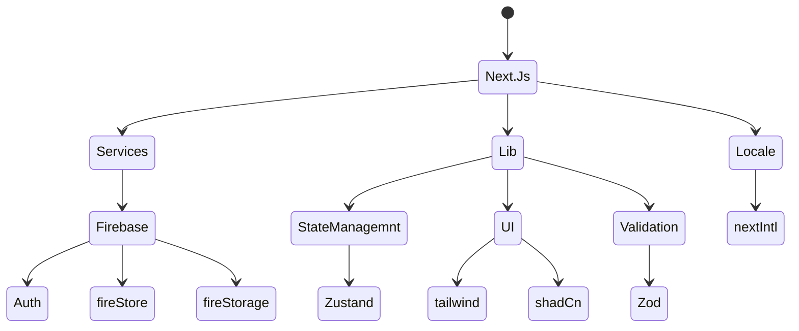

```
Here i will show each step in this project it will be as a learning tutorial
```

# Tech stack



<br/>

# File strucure

### i used ((src)) dir when i initialize the project with next js to make the project more orgnaized and scalabe

- Lib dir including the things is related to libraries

- Components dir it will include some dirs one of them is pages dir it will include the all pages dirs including there own component

  - it will have also shared dir it will include the all reusable and shared components

- Changelog file it will be use for tracing the changes
  that will made in each commit
